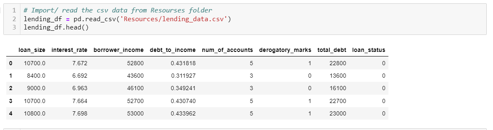
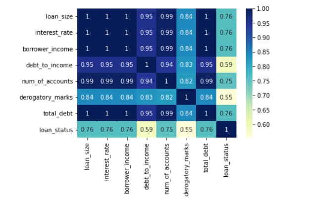
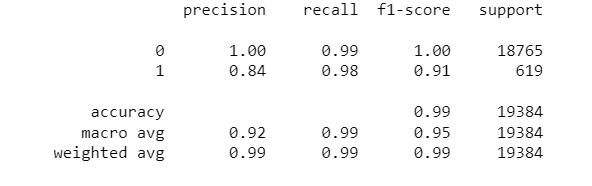
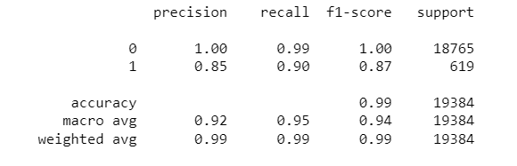

# Unit 19 Homework (Supervised Machine Learning): Predicting Credit Risk

# Overview
Lending services companies allow individual investors to partially fund personal loans as well as buy and sell notes
backing the loans on a secondary market. We used this data to create machine learning models to classify the risk level of given loans. Specifically, we compared the Logistic Regression model and Random Forest Classifier.

# Methodology
### Data Retrival
* Imported the lending_data.csv file as a Pandas dataframe 
* Confirmed that the import was successful by displaying the dataframe

### Data Wrangling
* Dropped any NAN values, if present
* Checked the features (columns) for coorelation

### Model Performance Prediction (Educated Guess)
Since our data is numeric, has only 8 features (columns) and shows a strong linear relationship among most features, my educated guess is that Logistic Regression model will perform better than the Random Forest Classifier model in predicting the risk level of given loans. Justification for the above prediction is based on the following information:

* Logistic Regression model is often used to predict two discrete classes (BINARY CLASSIFICATION) and is preferred when:
    * The data is mostly non-categorical and low-dimensional (i.e. the number of covariates is small compared to the sample size)
    * The relationship between the features and the target variable is quite linear
    * The goal is to explain the relationship between the features and target variable

* Random Forest Classifier model is preferrebly used when:
    * The data is more categorical and contains many features (big data sets)
    * The relationship between the features and the target variable is complex and non-linear
    * There is a need to understand feature importance

### Split the Data into Training and Testing Sets
* Created the features DataFrame, X , by removing the loan_status column 
* Created y , the labels set, by using the loan_status column 
* Split the data into training and testing datasets by using the train_test_split function 

### Preprocessed the Data
* Standardized the data (X) using StandardScaler function

### Created, Trained and Scored a Logistic Regression model 
* Created and trained a Logistic Regression model
* Scored the Logistic Regression model 
* Made prediction using the test data and checked the confusion matrix
* Compared actual model performance (test) with the prediction using classification_report

### Created, Trained and Scored a Forest Classifier model 
* Created and trained a Random Forest Classifier model 
* Scored the Random Forest Classifier model 
* Made prediction using the test data and checked the confusion matrix
* Compared actual model performance (test) with the prediction using classification_report

# Analysis
* Training and testing scores for both the models are pretty similar and good (.99/ .99).
* Precision and recall for the "Nonrisky" loans ("0") is also same for both the model (1 and 0.99 respectively).
* Precision and recall for the "Risky" loans ("1") is DIFFERENT for each model:
    1. Logistic Regression model has slightly low precision (0.84) as compared to Random Forest model (0.85). It is due to Logistic Regression model having more false positives (113) as compared to the Random Forest Classifier Model (100). This means that more "Nonrisky" loans are classified as "Risky" loans with Logistic Regression model. This might lead to loss of some potential clients but no bad loans/ loss of money to the company.  
  
    2. Random Forest Classifier model has a much lower recall (0.90) has compared to the Logistic Regression model (0.98). It is due to Random Forest Classifier model having more false negatives (60) as compared to Logistic Regression model (10). This means that more "Risky" loans are classified as "Nonrisky" loans by Random Forest Classifier model. This will lead to more BAD LOANS and LOSS OF MONEY to the company.  
    
* Hence Logistic Regression model is BETTER than the Random Forest Classifier model for classification of risk level of given loans.

---
© 2022 edX Boot Camps LLC. Confidential and Proprietary. All Rights Reserved.
